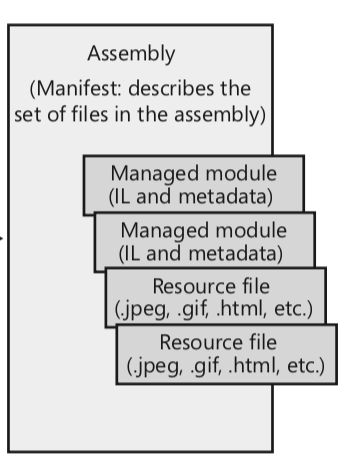
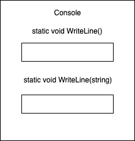
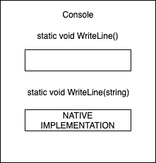
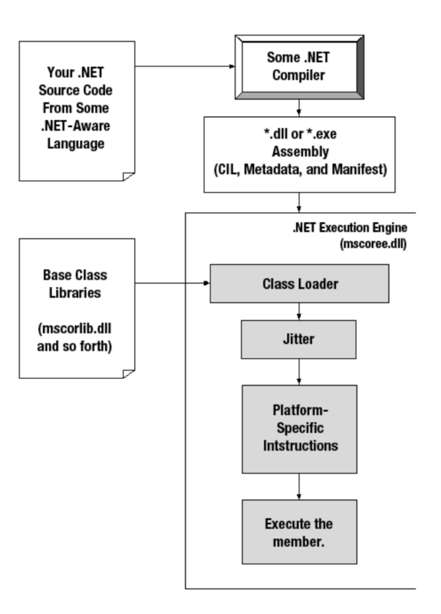

# Assemblies

## Introducción

El CLR no ejecuta directamente archivos o módulos sino que trabaja con lo que se conoce como _assembly_. Para entender el concepto de assembly debemos comprender que:
* Un assembly es un grupo lógico de uno o más archivos o módulos
* Un assembly es la unidad menor de reuso, liberación y versionado
* Los assemblies van acompañados por un archivo de metadata llamado _manifest_, que describe los archivos que forman el assembly. Es decir, es metadata que describe al propio assembly.
* Los assemblies van acompañados por archivos de recursos que necesite
* Los assemblies contienen módulos en IL y la metadata particular que describe a ese módulo

Un assembly no es mas que un archivo ejecutable (`.exe`) **o** un archivo con definiciones de tipos y funcionalidad para ser utilizado por un ejecutable (`.dll`).



## Ejecución de un Assembly

Como se describió anteriormente, cuando programamos en .NET programamos apuntando al CLR, el runtime de la plataforma. El compilador del lenguaje que elegimos compila nuestro código y lo agrupa en _assemblies_ que contienen **IL (Intermediate Language)** y **metadata**.

Para ejecutar un método el _Intermediate Language_ debe ser "traducido" a instrucciones de máquina, esto se debe a que el IL es agnóstico a la plataforma en la que ejecuta nuestro código, por lo que debe ser compilado para la arquitectura particular de nuestra CPU.

De esto es responsable el compilador JIT (just-in-time) del CLR. (A veces también conocido como _Jitter_). Distintas arquitectura utilizarán distintos _jitters_, cada uno optimizado para la CPU en particular según el caso (Servidor, Windows Phone, etc)

```cs
public static void Main() {
  Console.WriteLine("First method call");
  Console.WriteLine("Second method call");
}
```

1. Antes de que `Main` ejecute el CLR detecta todos los tipos utilizados por el código de `Main`, en este caso el unico es `Console`.
2. Se ubica en memoria una estructura para guardar el tipo `Console`.
3. Esta estructura ubicada en memoria contiene una entrada para cada método definido por el tipo `Console`.



4. Cada una de estas entradas contiene una dirección de memoria a donde se encuentra la implementación del método.
5. Cuando el método se invoca por primera vez, se llama al _JIT Compiler_.
6. En el assembly en el que se define `Console`, utilizando su metadata, se busca el método `WriteLine` y se obtiene el IL para este método.
7. Este IL es compilado a instrucciones de máquina y esto se guarda en una dirección de memoria.
8. En la estructura se indica la dirección de memoria en la que se guardaron las instrucciones de máquina.
9. La siguiente vez que se invoca el método, este proceso de compilación utilizando el JIT se evita y se accede directamente a las instrucciones de máquina. La primera vez que el método es ejecutado puede verse algún impacto en la performance.



## Resumen


