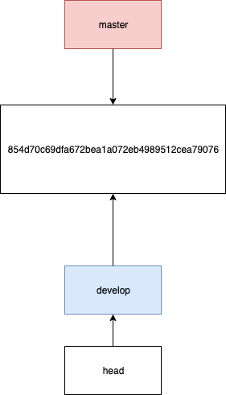

# Trabajando con Branches

Una _branch_ en Git no es más que un puntero a un commit. Por defecto la branch inicial siempre se denomina `master`, aunque no difiere en su comportamiento con ninguna otra branch.

## `git branch <name>`

Este comando crea una nueva branch que referencia al commit en el que estábamos posicionados.

Por ejemplo si hacemos

```
git branch develop
```

<p align="center">
  
</p>

Obtenemos un puntero `develop` que referencia al mismo commit en el que estábamos.

**NOTAR el puntero HEAD, que referencia siempre al puntero en el que estamos posicionados**

## `git checkout <name>`

Este comando mueve **HEAD** a la branch que se especifique

Por ejemplo si hacemos

```
git checkout develop
```

<p align="center">
  
</p>

Ahora tenemos que HEAD apunta a la branch develop

## `git checkout -b <name>`

Es un shortcut que nos permite hacer en un paso lo que especificamos en los dos comandos anteriores, es decir, crea una branch e inmediatamente mueve HEAD a la nueva branch creada
