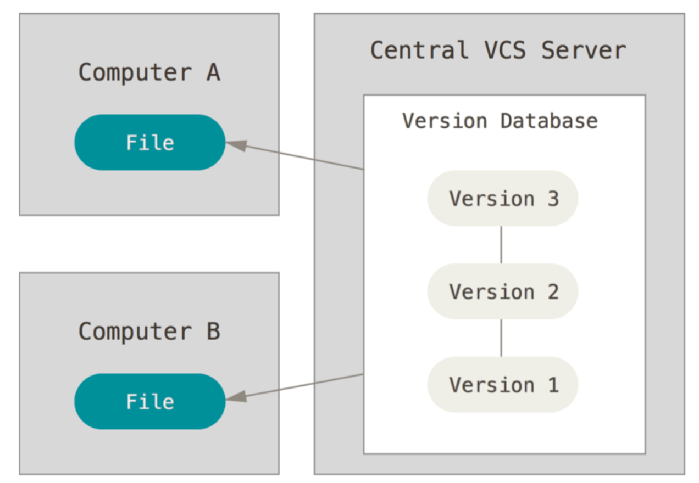

# Introducción

## Sistema de control de versiones

Un sistema de control de versiones guarda versiones específicas de un archivo o un conjunto de archivos y nos provee la habilidad de obtener cualquiera de esas versiones luego en el tiempo.

Una solución casera de un sistema de control de versiones sería guardar versiones distintas de los archivos que necesitemos en carpetas organizadas por fecha de forma manual. Este mecanismo es tremendamente propenso a errores y hoy en día tenemos herramientas que nos resuelven muchas de estas dificultades de forma sencilla (Team Foundation Server, Git, SVN, entre otros).

## Clasificación

Los sistemas de control de versiones se clasifican en centralizados y descentralizados en función de cómo resuelvan la colaboración de múltiples personas en un mismo repositorio.

### Sistema de control de versiones centralizado

  

Los sistemas de control de versiones **centralizados** contienen todos los archivos versionados en un único servidor y los clientes acceden a los archivos necesarios desde ese servidor central.

### Sistema de control de versiones descentralizado

  

Los sistemas de control de versiones **descentralizados** contienen una copia **completa** del repositorio que se encuentra en el servidor, incluída su historia.
