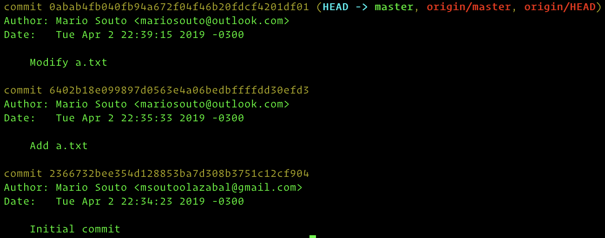

# Literate Potato :sweet_potato:

## Introducción

Literate Potato es un ejercicio que tiene como objetivo comprender como aplicar efectivamente el comando `git rebase` e introducirse en la resolución de conflictos entre archivos en Git.

## Pasos

1. Forkear [literate-potato](https://github.com/mariosouto/literate-potato)
2. Clonar el repositorio forkeado
3. Visualizar que branches son las que tenemos
4. Movernos a la branch `feature/add-b`
5. Desde `feature/add-b` rebasear con `master`
6. Actualizar la branch `feature/add-b` remota
7. Mergear `feature/add-b` en `master` desde Github

## Estado inicial de `feature/add-b`

  

## Estado inicial de `master`

  

## Diagrama

  

