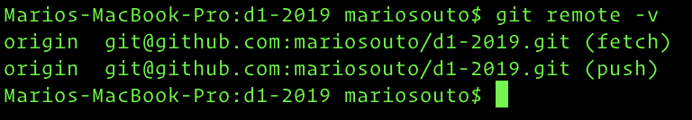

# Trabajando con repositorios remotos

Un repositorio remoto es una versión de nuestro proyecto hosteada en Internet. Podemos eventualmente trabajar con múltiples repositorios remotos a la vez y manejar distintos niveles de permisos para cada uno.

## `git remote`

Nos muestra el listado de todos los repositorios remotos que nuestro proyecto tiene configurado. Si clonamos un repositorio remoto solamente tenemos `origin` que es el nombre por defecto que se le otorga al servidor del cual clonamos.

<p align="center">
  
</p>

## `git remote -v`

Si al comando anterior le agregamos el parámetro `-v` además podemos visualizar la url que se utiliza para leer y escribir al repositorio

<p align="center">
  
</p>

## `git remote add <shortname> <url>`

Eventualmente podemos agregar cuantos repositorios remotos necesitemos, para ello es necesario especificar la URL del mismo y un nombre que vamos a usar como alias para referirnos a el (el nombre puede ser cualquiera).

Por ejemplo si fuéramos a agregar el repositorio anterior de forma manual

```
git remote add origin git@github.com:mariosouto/d1-2019.git
```

## `git fetch <remote>`

El comando nos permite "bajar" la información que aún no tenemos de un repositorio remoto. Por ejemplo si queremos bajar alguna branch en particular

```
git fetch <remote> <branch>
```

En este caso

```
git fetch origin master
```

## `git push <remote> <branch>`

Los comandos mostrados hasta el momento realizan operaciones sobre el repositorio local. Si, llegado el caso, quisiéramos que nuestro trabajo quedara guardado en alguno de los repositorios remotos que disponemos tenemos que ejecutar el siguiente comando

```
git push <remote> <branch>
```

Donde:
* `<remote>` es el shortname al que le pusimos al repositorio remoto, por defecto es `origin`.
* `<branch>` es la rama del repositorio local que queremos "pushear" al repositorio remoto.

```
git push origin master
```

Pusheará la rama **master** local a la rama **master** del repositorio remoto con el alias **origin**

## `git pull <remote> <branch>`

El comando esencialmente funciona igual que el `push`, con la obvia diferencia que en lugar de subir información en este caso vamos a **bajar** información.

```
git pull origin master
```

De la misma forma vamos a pullear la rama **master** del repositorio remoto con el alias **origin** a la rama **master** del repositorio local.
