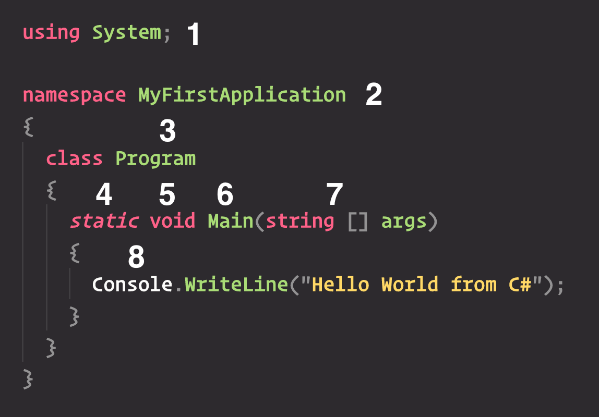

# C# paso a paso



1. La palabra reservada `using` seguida del nombre del `namespace` es la sintaxis que utiliza el lenguaje para importar código que se encuentre definido en otro `namespace`.

2. Luego definimos el `namespace` en el que se encuentra nuestra clase, la sintaxis es `namespace` y el nombre del mismo delimitado por llaves. Definir un `namespace` no es obligatorio, pero es considerado una buena práctica.

Si no definimos un `namespace` el código que escribamos "caerá" en lo que se conoce como el _namespace global_.

Por ejemplo dada la clase `Dog` definida en el namespace global, con un método `Bark`, si quisiéramos invocar el mismo

```cs
class Dog
{
  public static void Bark()
  {
    Console.WriteLine("Woof!");
  }
}

global::Dog.Bark();
```

3. Nuestro código va encapsulado dentro del _scope_ de una clase. Las clases se definen con la keyword `class` y el nombre de la misma delimitado por llaves.

4. La definición del método lleva la palabra reservada `static` que indica que el método es de la clase `Program` y que por tanto no es necesario instanciar la misma para invocarlo.

5. Al igual que en Java la palabra clave `void` se utiliza para indicar que el método no devuelve ningún valor al final de su ejecución.

6. Cualquier aplicación ejecutable en C# debe comenzar con un método `Main`, el mismo será el punto de entrada por donde la aplicación iniciará su ejecución. 

Notar que el nombre del método `Main` se encuentra en mayúscula, a diferencia de Java donde los métodos comenzaban en minúscula, en C# todos los métodos siguen esta nomenclatura.

7. Los argumentos o parámetros que recibe nuestro método van delimitados por paréntesis, y siguen el formato `type name`, en este caso el método `Main` recibe como parámetro un array de strings llamado `args`.

8. Por último el código a ejecutar por nuestro método se encuentra entre llaves que delimitan el cuerpo del mismo. En este caso nuestro método imprime un mensaje a la consola y luego finaliza.
