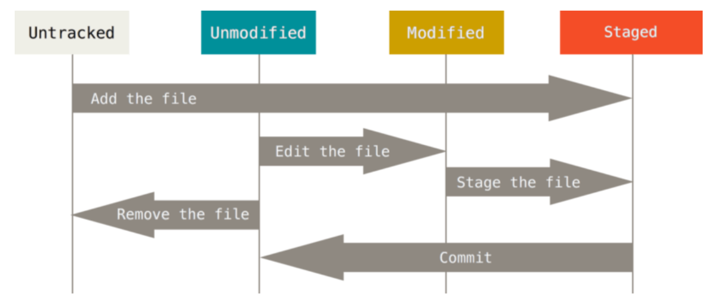
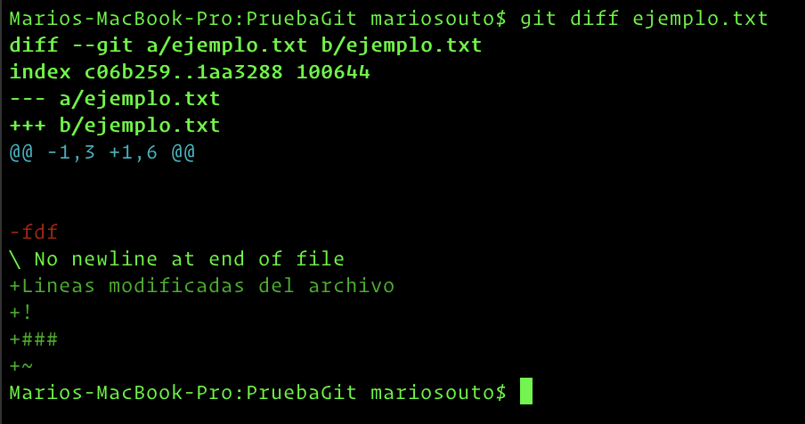
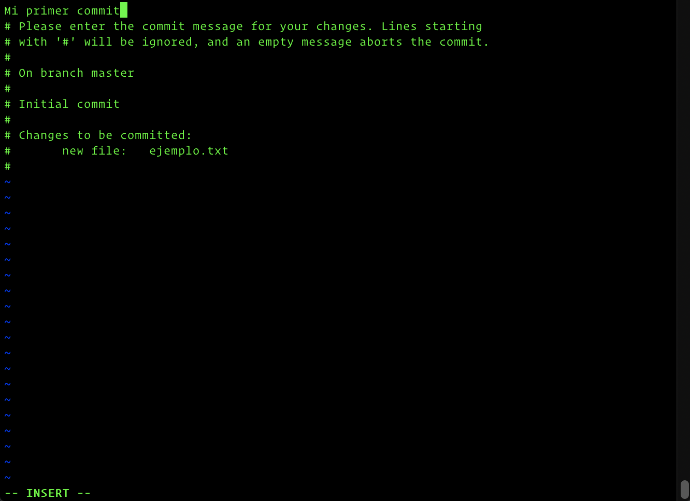
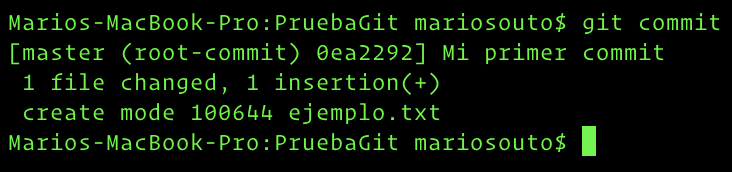
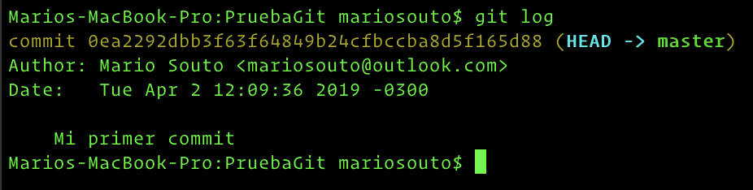

# Estados de un archivo

Como establecimos anteriormente Git maneja nuestra información como una lista de **snapshots**, es decir, como una lista de "fotos" del estado en el que estaban nuestros archivos al momento de escribir en el repositorio (realizar un _commit_).

Inicialmente nuestros archivos estarán en dos estados: **tracked** y **untracked**.

* Los archivos **tracked** son archivos que Git ya conoce debido a que fueron incluídos en nuestro repositorio en un **snapshot** anterior. Pueden estar en estado **staged** (listos para ser incluídos en el proximo snapshot), **modified** (fueron modificados pero para incluir el cambio hay que moverlos a staged) o **unmodified**.
* Los archivos **untracked** son archivos nuevos que no fueron incluídos en un snapshot anterior y que no fueron marcados como _staged_ para ser incluídos en el próximo snapshot.

Lo anterior puede resumirse con el siguiente diagrama.

<p align="center">
  
</p>

Esto nos servirá como pie para introducir otros comandos de git.

## `git status`

Este comando nos muestra el resumen de lo anterior, es decir, el estado de nuestros archivos. Particularmente nos muestra los archivos que no están siendo trackeados, los archivos que fueron modificados desde el último snapshot y los archivos listos para ser incluídos en el próximo.

<p align="center">
  
</p>

En la imagen anterior

* Creamos un nuevo archivo con el comando `touch`
* Corremos `git status` y nos muestra que inicialmente el archivo es `untracked` dado que es nuevo y no se encontraba en ningún snapshot anterior

## `git add`

Este comando nos permite movernos desde `untracked` y `modified` a `staged`. Es decir, todos los archivos los que les apliquemos `git add` serán marcados como `staged` y por ende serán incluídos en el próximo snapshot

<p align="center">
  
</p>

Como vemos en la imagen el archivo recientemente creado está marcado como _staged_ y se encuentra debajo de _Changes to be committed_

## `git add .`

`git add .` es un shortcut que nos permite mover todos los archivos `untracked` y `modified` a `staged` sin tener que hacerlo uno por uno.

<p align="center">
  
</p>

Por ejemplo, una vez commiteado el archivo y luego modificado, si realizamos `git add .` lo movemos de `modified` a `staged`.

## `git diff`

Este comando nos permite ver que fue lo que cambiamos en un archivo desde su snapshot anterior.

<p align="center">
  
</p>

## `git commit`

Una vez que marcamos los archivos necesarios como `staged` estamos listos para guardar un nuevo **snapshot** en el repositorio.

**Git solamente guarda en el repositorio los archivos marcados como staged. Archivos modificados que no fueron marcados no serán incluídos en el siguiente snapshot**

Simplemente escribimos

```
git commit
```

y esto abrirá un editor donde podremos escribir un mensaje de commit

<p align="center">
  
</p>

<p align="center">
  
</p>

En resumidas cuentas, esto genera un nuevo commit dentro del repositorio con su correspondiente SHA-1 hash como vimos anteriormente.

## `git commit -m` y `git commit -a -m`

Son shortcuts del comando anterior

* `git commit -m` nos permite crear un nuevo commit al que le pasamos un mensaje sin la necesidad de abrir un edito intermedio

```
git commit -m "Mi primer commit"
```

* `git commit -a -m` se comporta igual que `git commit -m` con la excepción de que nos marca todos los archivos de nuestro directorio como `staged`, es decir, nos evitamos tener que correr `git add`.

```
git commit -a -m "Mi primer commit"
```

## `git log`

En todo momento podemos ver la historia de la **branch** en la que estamos parados (hablaremos más en detalle de los branches más adelante).

Si escribimos

```
git log
```

en la terminal el comando nos despliega la lista de commits realizados de la branch actual

<p align="center">
  
</p>

## `git reset`

¿Qué sucede si pasamos a **staged** un archivo que en realidad no queremos agregar en el commit? ¿Cómo lo podemos quitar de staged?

```
git reset HEAD ejemplo.txt
```

## `git checkout`

Este comando nos sirve para descartar cambios que hayamos realizado sobre un archivo. **Es importante tener cuidado con este comando ya que los cambios realizados se perderán totalmente**

```
git checkout -- ejemplo.txt
```

Descarta los cambios realizados sobre el archivo desde el último snapshot
