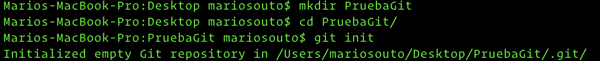

# Primeros Pasos

Tenemos dos formas para comenzar a utilizar Git. Las mismas nos servirán para introducir los dos primeros comandos de la herramienta:
* Empezar con un nuevo repositorio de Git
* Clonar un repositorio de Git ya existente

## `git init`

Este comando inicializa un nuevo repositorio git dentro del directorio que deseemos versionar. Simplemente nos movemos dentro de dicho directorio y ejecutamos

```
git init
```

<p align="center">
  
</p>

En resumen:
* Creamos un nuevo directorio utilizando el comando `mkdir`
* Navegamos dentro del mismo utilizando `cd`
* Luego `git init` y tenemos nuestro repositorio

De hecho si abrimos la carpeta creada en un editor como Visual Studio Code podemos ver el directorio `.git` creado con su contenido.

<p align="center">
  
</p>

`.git` contiene todos los archivos necesarios para que el repositorio funcione.

## `git clone`

La otra forma para comenzar a utilizar Git es clonar un repositorio ya existente. Para ello ejecutamos

```
git clone [url_del_repositorio]
```

La URL del repositorio varía según el protocolo utilizado para clonar el mismo, por ejemplo

```
git clone utilizando SSH

git clone git@github.com:mariosouto/d1-2019.git
```

```
git clone utilizando HTTPS

git clone https://github.com/mariosouto/d1-2019.git
```

Esto nos crea un directorio llamado `d1-2019` donde dentro podremos ver la carpeta `.git` con la información del repositorio

