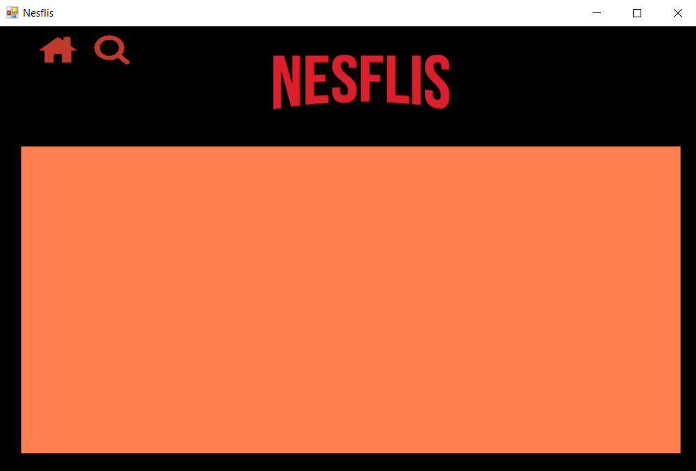

  

Nesflis es una aplicación de ejemplo que tiene como objetivo realizar una introducción básica a [Windows Forms](https://docs.microsoft.com/en-us/dotnet/framework/winforms/).

## Principales componentes

Nesflis despliega una lista de películas y permite buscar actores que hayan participado en alguna pelicula y filtrar las mismas por género.

Los controles de Windows Forms utilizados son:
* Form
* UserControl
* Panel
* Button
* PictureBox
* ComboBox
* TextBox

## Navegación

Nesflis utiliza una única Ventana (`Form`) y muestra/oculta el contenido (encapsulado en `UserControl`) según la pantalla a la que se desea navegar. El objetivo, analizando desde la usabilidad, es que el usuario permanezca siempre en una misma ventana, no abriendo nuevas, para dar la "sensación" de que se está siempre en la misma aplicación.

## Ejercicio

Tal como lo muestra la imagen la aplicación está incompleta. Cuando clickeamos sobre un poster, en lugar de acceder a los detalles de la película, obtenemos un panel de color naranja vacío.

El ejercicio será agregar los controles de Windows Forms necesarios para mostrar los detalles de una película en pantalla.

Para ello se deberá modificar el UserControl `MovieDetailsUserControl`.
