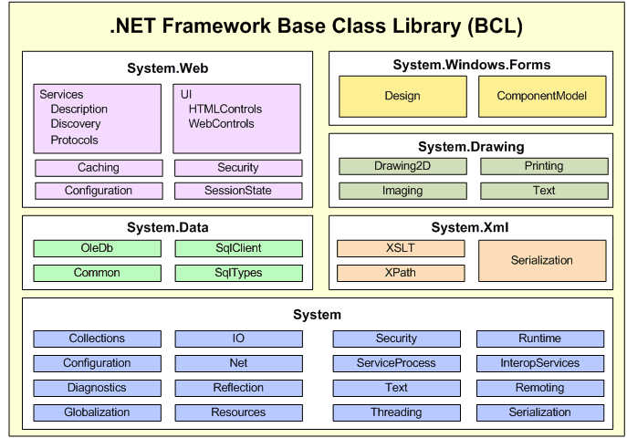

# Arquitectura interna de .NET

A alto nivel .NET puede verse como dos grandes bloques:
* Librerías de clases base (_Base Class Library_ o BCL)
* Ambiente de ejecución (_Common Language Runtime_ o CLR)

## Librerías de clases base (BCL)

.NET provee un conjunto de librerías base que son accesibles por todos los lenguajes soportados por el framework (C#, F#, Visual Basic, C++, entre otros).

Las librerías encapsulan distintas funcionalidades como manejo de _threads_, acceso a archivos, llamadas remotas, acceso a la API de UI, manejo de bases de datos, etc.



El _namespace_ System de la BCL, importado en C#.

```cs
using System;
```

El _namespace_ System de la BCL, importado en C++.
```cpp
using namespace System;
```

## Ambiente de ejecución (CLR)

El _Common Language Runtime (CLR)_, como su nombre lo indica, es un _runtime_ que puede ser utilizado por distintos lenguajes de programación. Las funcionalidades que el CLR provee (como manejo de memoria, manejo de excepciones, sincronización de threads, seguridad, entre otras) son accesibles por cualquier lenguaje que le sea compatible.

De hecho el CLR no conoce el lenguaje de programación elegido por nosotros. Se podría utilizar cualquier lenguaje siempre que el compilador del mismo genere un **lenguaje intermedio** que el CLR pueda interpretar.

A alto nivel el proceso puede ser descrito con el siguiente diagrama


* El _Intermediate Language_ es el código que luego el CLR maneja en tiempo de ejecución
* La _Metadata_ puede ser entendida como información que describe que es lo que está definido en cada módulo (tipos y métodos)

La _Metadata_ tiene distintos usos, por ejemplo:
* Visual Studio utiliza la metadata para el uso de _intellisense_, es decir sugerir métodos disponibles y los parámetros requeridos.
* Serialización y deserialización de objetos para transferencia entre máquinas remotas.
* Determinación del tiempo de vida de un objeto por el Garbage Collector.

## Disclaimer

**IL, MsIL (Microsoft Intermediate Language) y CIL (Common Intermediate Language) describen siempre el mismo concepto**
